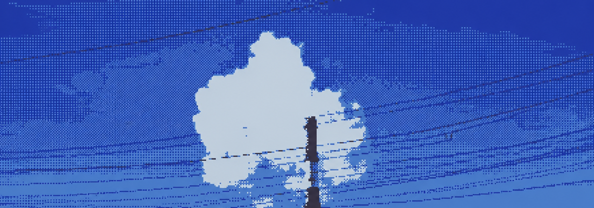

<div align="center">
  

  <br />

  <code>LIKELYLUCID / MICHAEL MCKELLAR</code>

  <h1>Hi, I'm Michael.</h1>

  <p>
    <strong>data science · applied ML · Linux systems · creative tools</strong>
  </p>

  <p>
    <a href="https://github.com/LikelyLucid">
      
    </a>
    <a href="https://www.linkedin.com/in/michael-arthur-mckellar">
      
    </a>
    <a href="https://instagram.com/likelylucid_">
      
    </a>
    <a href="mailto:michael.mckellarr@gmail.com">
      
    </a>
  </p>

  <sub>wallust palette · quiet surfaces · one good accent</sub>
</div>

<br />

I’m a **data science student in New Zealand** who likes working where messy data, useful software, and slightly over-engineered systems overlap.

I build things to understand them: models, personal tools, local AI experiments, self-hosted services, and Linux desktops that are deliberately configured down to the last pixel.

```text
now       → learning, shipping, breaking, fixing
interests → applied ML · NixOS · self-hosting · HCI · good coffee
principle → make the machine feel like mine
```

## What I’m building around

| area | what that looks like |
| :--- | :--- |
| **data + ML** | Turning real-world mess into models, visualisations, and answers that are actually useful. |
| **systems** | NixOS, homelabs, automation, reproducible configs, and tools that work locally first. |
| **interfaces** | Human-computer tools, desktop widgets, terminal workflows, and small details that make software feel calm. |
| **experiments** | Creative software, strange prototypes, and projects that teach me something by existing. |

## Selected builds

- [**Hermes Agent**](https://github.com/LikelyLucid/hermes-agent) — an agent that grows with you; I work on the desktop, tooling, and the edges where software meets people.
- [**CUA**](https://github.com/LikelyLucid/cua) — computer-use infrastructure for open-source drivers, fleets, and evaluation.
- [**dotfiles**](https://github.com/LikelyLucid/dotfiles) — NixOS-adjacent desktop configuration, Wallust theming, Waybar, Eww, and the ongoing battle against configuration drift.
- [**Nothing Headphone CLI**](https://github.com/LikelyLucid/nothing-headphone-cli) — an unofficial Linux CLI and orientation visualiser for Nothing Headphone (1).
- [**Spotify Textualize**](https://github.com/LikelyLucid/Spotify_Textualize) — a Python experiment for turning listening history into something readable.

## Toolbox

<p>
  
  
  
  
  
  
  
  
</p>

<details>
  <summary><code>palette / wallust</code></summary>

  <br />

  <code>#00000B</code> canvas &nbsp;·&nbsp;
  <code>#00000D</code> surface &nbsp;·&nbsp;
  <code>#DFE9F6</code> text &nbsp;·&nbsp;
  <code>#8C97A3</code> muted &nbsp;·&nbsp;
  <code>#C9D8EA</code> accent &nbsp;·&nbsp;
  <code>#7F91CD</code> cursor
</details>

<br />

<div align="center">
  <sub>building slowly · shipping often · making a mess of the right things</sub>
</div>
